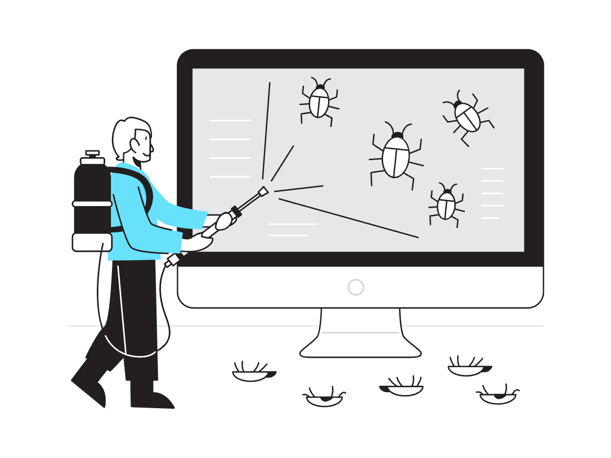

# Phoenix-Scope-Open-Source

## Description

A microservice application that provides an APIs to fetch the scope of bug bounty programs listed on various platforms such as HackerOne, BugCrowd, Intigriti, and YesWeHack, as well as UI dashboards to view the data.

## Features

- Covers 4 Bug Bounty Platforms
  - HackerOne
  - Bug Crowd
  - Intigriti
  - Yes We Hack
- Ability to create Custom Monitoring Alerts for Scope Changes for any Program avaialable on any Platform
- Basic Asset Enumeration for any program requested by user with details shared over slack, discord, telegram and pushbullets.
- Multiple filters to get the specific type of scope and type of program such as programs with only wildcard scopes, private programs with url scope, etc.

## Roadmap

- Deployed on AWS, current version is only helpful for getting the data for specific platform based on the API token and username(For H1 only) provided.
- Version 1.2 includes the Basic Asset Enumeration and Alert features on the dashboard itself.
- Version 2.0 includes monitoring and custome alerts for scope changes.

## How to Set up Guide ?

- Clone the repository either in your local system or VPS: `git clone https://github.com/0xfa1c/Phoenix-Scope-Open-Source.git phoenixScope`
- Navigate to the repository: `cd phoenixScope`
- Execute the Command: `docker-compose up --build -d`
- Visit the URL: `http://localhost:8080` or `http://VPS_PUBLIC_IP:8080`
- If you want to access the Swagger Documentation of the APIs just append `/docs` at the end of the URL

## Post Installation

- Check if your docker is properly deployed and running:
  -  List all the docker containers available: `docker ps`
  -  Check the logs of the container using container ID: `docker logs <containerID>`
